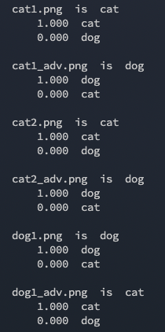
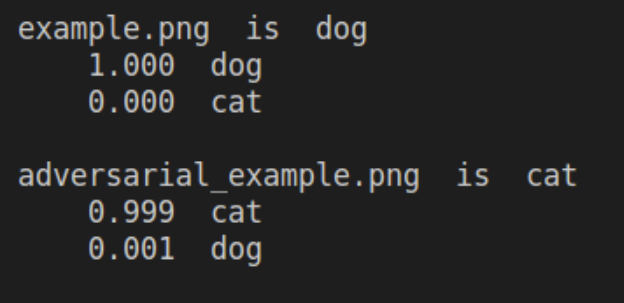

# Solution
## Adversarial versions


| 檔名 | 原始 | 對抗 |
|:---:|:---:|:---:|
| cat1 |  |  |
| cat2 |  |  |
| dog1 |  |  |

## 使用方式
```bash=
$ python3 run.py [IMAGE] [INDEX OF CLASS]
```

### 參數
- IMAGE
    - File name 
- INDEX OF CLASS
    - Cat = 0
    - Dog = 1

### 範例
```bash=2
$ python3 run.py cat1.png 1
$ python3 run.py cat2.png 1
$ python3 run.py dog1.png 0
```

### 備註
ResNet圖片預處理模式為caffe，所以最後需要將圖片做還原。
> caffe: RGB轉換成BGR，扣除ImageNet平均BGR [103.939, 116.779, 123.68]）

### Credit: 
1. [Paper](https://arxiv.org/abs/1412.6572)
2. [FGSM-Keras](https://github.com/soumyac1999/FGSM-Keras)

---

# Adversarial Machine Learning

The widespread use of artificial intelligence (AI) in today's computer systems incurs a new attack vector for computer security, as the AI can be fooled to take incorrect or even unsafe actions.

In this mini-project, you are given an image classifier (<em>predict.py</em>), which is pre-trained to recognize dogs and cats. After installing python3 and [keras](https://keras.io/), you can use the following command with filenames of the images you want to classify as the arguments.

```bash
$ python3 predict.py cat1.png cat2.png dog1.png
```

it will show the classification probabilities as follows:


The classifier identifies the dog image correctly. Now, if we add some noises that are imperceptible to human beings to the dog image. The resulting image file is named *adversarial_example.png*. Let us rerun the classifier.

|   |    |
|---|---|
| Example | Adversarial Example   |

Interestingly, the *adversarial_example.png* is miss-classified as a cat!



For the mini-project, you are given three images (cat1.png, cat2.png, dog1.png). Please create their adversarial versions, which will be misclassified by the classifier.

Hint: https://www.tensorflow.org/tutorials/generative/adversarial_fgsm