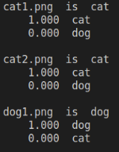

# Adversarial Machine Learning

The widespread use of artificial intelligence (AI) in today's computer systems incurs a new attack vector for computer security, as the AI can be fooled to take incorrect or even unsafe actions.

In this mini-project, you are given an image classifier (<em>predict.py</em>), which is pre-trained to recognize dogs and cats. After installing python3 and [keras](https://keras.io/), you can use the following command with filenames of the images you want to classify as the arguments.

```bash
$ python3 predict.py cat1.png cat2.png dog1.png
```

it will show the classification probabilities as follows:



The classifier identifies the dog image correctly. Now, if we add some noises that are imperceptible to human beings to the dog image. The resulting image file is named *adversarial_example.png*. Let us rerun the classifier.

|   |    |
|---|---|
| Example | Adversarial Example   |

Interestingly, the *adversarial_example.png* is miss-classified as a cat!


For the mini-project, you are given three images (cat1.png, cat2.png, dog1.png). Please create their adversarial versions, which will be misclassified by the classifier.

Hint: https://www.tensorflow.org/tutorials/generative/adversarial_fgsm  
